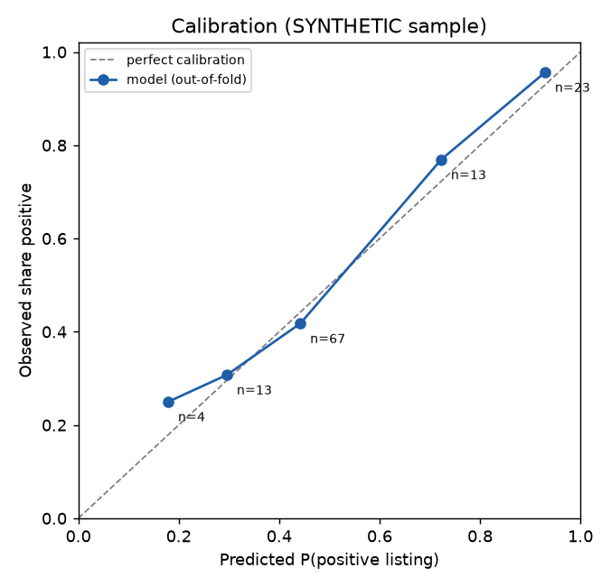
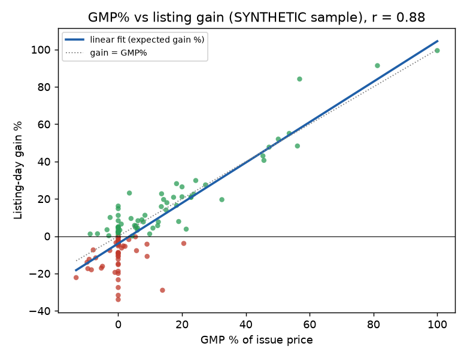
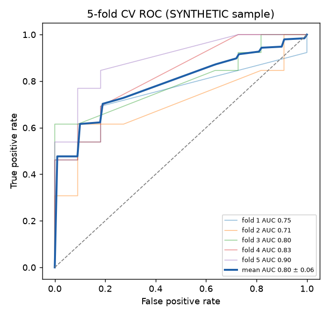

# IPO listing-gain model: how much does the grey market know?

> **Disclaimer.** This is educational research code. It is **not investment advice**, not a recommendation to
> apply for, buy, sell or hold any security, and not a signal for any current or upcoming IPO. The author is
> **not a SEBI-registered investment adviser or research analyst**. Past relationships in data do not
> guarantee future outcomes. Do your own research and consult a registered professional.

**Author:** Kanishk Dev Bangia · Python 3.11 · MIT License

## Problem
Before an Indian IPO lists, an informal "grey market premium" (GMP) circulates: the premium over the issue
price at which shares reportedly change hands before listing. Retail investors read GMP as a forecast of
listing-day gains. The research question here is narrow and measurable:

*From GMP alone, how well can we estimate (a) the probability that an IPO lists above its issue price and
(b) the size of the listing-day move? And are those probabilities calibrated?*

## Approach
- **Feature:** `gmp_pct = GMP / issue price × 100`. **Targets:** `listing_gain_pct` and `positive = gain > 0`.
- **Models:** standardised logistic regression for P(positive) and linear regression for expected gain %.
- **Model comparison:** 6 classifiers and 3 regressors (logistic on 1, 2 and 4 features; sigmoid-calibrated
  logistic; random forest; gradient boosting; linear, ridge, Huber), scored with repeated stratified 5-fold
  CV (10 repeats).
- **Honest evaluation:** every headline number is **out-of-fold**, reported against the majority-class
  baseline, with a reliability (calibration) table and Brier score.

## Results

### Original study: 83 real listed IPOs (data not redistributed)
From the original model card, on the real 83-IPO dataset (59 SME, 23 mainboard, 1 REIT, May 2026):
- **5-fold CV AUC 0.842**, accuracy 0.76 vs a 0.51 baseline.
- corr(GMP%, listing gain%) = 0.87.
- A **0% GMP** issue listed positive only about **38%** of the time. GMP had to be **≈ +5%** to reach even odds.
- Out-of-fold, predictions of 70% or higher listed positive every time, and predictions under 30% never did.
- Of 7 algorithms tried, the GMP-only model matched or beat multi-feature models. On ~80 rows, extra
  features added noise.

### This repo, out of the box: SYNTHETIC sample (`make demo`)
These numbers come from 120 **synthetic** rows (`data/sample/ipo_synthetic.csv`, generator documented in
`src/ipo_model/synthetic.py`). They show the pipeline working. They are **not** evidence about real markets.

| Metric (synthetic) | Value |
|---|---|
| Rows / positive rate | 120 / 54% |
| corr(GMP%, gain%) | 0.885 |
| Out-of-fold AUC (GMP-only logistic) | **0.795** (repeated CV: 0.794 ± 0.077) |
| Out-of-fold accuracy vs majority baseline | **0.76 vs 0.54** |
| Brier score | 0.181 |
| P(positive) at 0% GMP · GMP for even odds | 41% · ≈ +3.2% |
| Best regressor, CV R² / MAE | linear GMP-only, 0.776 / 7.2 pp |

The synthetic run reproduces the qualitative finding: the one-feature logistic (AUC 0.794) beats the same
model with all features (0.768), random forest (0.759) and gradient boosting (0.736). The regression slope
recovers the generator's true value (1.05) within tolerance; a unit test checks this. Full tables are in
[`results/RESULTS.md`](results/RESULTS.md).

| Calibration | GMP% vs listing gain | 5-fold ROC |
|---|---|---|
|  |  |  |

## Honest negatives: what did *not* work
Alongside this model, I tested a **Nifty 50 next-day direction classifier** on technical features: 10 years
of daily data, strict walk-forward splits (no look-ahead), and three algorithms. It reached **53% accuracy,
below the 54% base rate** of up-days. Every strategy backtest built on it **underperformed buy-and-hold**.
It has no edge, so **it was not shipped** and its code is not published here. The result is consistent with
daily index direction being close to unpredictable from price-derived technicals. Reporting it shows the bar
the IPO model had to clear: beat a naive baseline out-of-sample, or don't ship.

## Limitations
- Small, SME-heavy sample from one market regime. Coefficients will drift.
- GMP is an unregulated, informal quote. It can be stale, manipulated or reported inconsistently.
- The feature must be the **last GMP before listing**. A later snapshot leaks the label.
- Only issues that listed and had a reported GMP are included (selection bias).
- Listing-day outcomes are fat-tailed, so expected-gain estimates have wide error bars.

See [`MODEL-CARD.md`](MODEL-CARD.md) for intended use and risks.

## How to run
```bash
make demo   # creates .venv, regenerates the synthetic sample, metrics and the 3 charts in results/
make test   # 7 unit tests (feature math, monotonicity, slope recovery, CV beats baseline, HTML parser)
```
Without make: `pip install -r requirements.txt`, then `PYTHONPATH=src python -m ipo_model.evaluate`.

**Your own data.** No third-party data ships here. Assemble a table from a source whose terms permit it,
then run:
```bash
PYTHONPATH=src python -m ipo_model.fetch --url "<page with a GMP vs listing table>" --out data/raw/ipos.csv
PYTHONPATH=src python -m ipo_model.evaluate --raw data/raw/ipos.csv --out results_real
```
`data/raw/` is git-ignored. Required columns: `issue_price, gmp, listing_price`. Optional: `type,
subscription_x, size_cr`.

## Layout
```
src/ipo_model/synthetic.py   documented synthetic generator (seeded)
src/ipo_model/fetch.py       bring-your-own-source HTML table fetcher + normaliser
src/ipo_model/dataset.py     feature/target construction
src/ipo_model/model.py       model zoo, repeated-CV comparison, final GMP-only models
src/ipo_model/evaluate.py    end-to-end run -> results/metrics.json, RESULTS.md, figures/
tests/                       pytest suite
```
